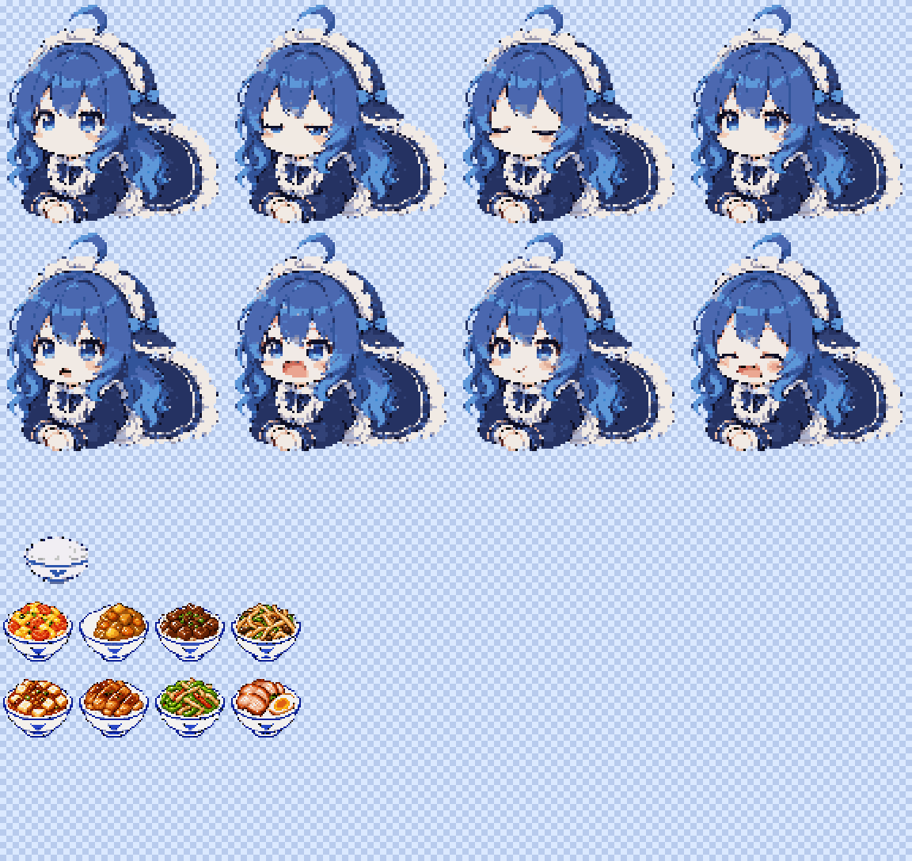

# DeepSeek Token Pet

一个可独立运行、也可嵌入其他客户端的 token 驱动像素桌宠。鲸鱼娘会随机眨眼、根据最近 5 秒的 token 消耗改变尾巴摆动速度，并按累计用量吃饭：

```text
1,000,000 tokens = 1 份食物
```

计数包含普通输入、输出、缓存读取和缓存写入，不按价格或缓存折扣换算。



> 本项目是非官方社区项目，不属于 DeepSeek。公开分发前请自行确认角色形象与商标的使用权限。

## 直接使用

如果拿到已经打包的 Windows 便携版，可以直接运行：

```text
DeepSeek Token Pet 0.2.3.exe
```

首次启动后，桌宠会同时在本机启动 `http://127.0.0.1:47832`。右下角按钮可以拖动缩放；“喂饭”按钮只预览一次动画，不增加 token 或食物数量。

Git 仓库不存放大型 EXE；从源码运行需要 Node.js 20+ 和 pnpm：

```powershell
pnpm install
pnpm build
node dist/cli.js serve --open
```

常用调试命令：

```powershell
# 增加 100 万 tokens，触发一份食物
node dist/cli.js add 1000000

# 输出当前文字状态
node dist/cli.js tui

# 启动 Electron 桌面窗口
pnpm desktop
```

桌面版默认把账本保存在：

```text
%USERPROFILE%/.deepseek-token-pet-state.json
```

## 导入食物素材

把 PNG 放进 `assets/foods/` 的任意子目录即可。服务只在启动时扫描一次，所以添加、删除或替换食物后需要重启桌宠。

每个食物文件必须满足：

- 单张透明 PNG，不是序列帧；
- 尺寸严格为 `48 × 48`；
- 文件名以 `{正整数权重}` 结尾，例如 `curry-rice{5}.png`；
- 可以创建任意层级的子文件夹，扫描会递归进行。

示例：

```text
assets/foods/
├── core/
│   └── plain-rice{10}.png
└── my-food-pack/
    ├── curry-rice{5}.png
    ├── tomato-egg{3}.png
    └── beef-rice{2}.png
```

花括号里的数字是随机权重，不是百分比。上例三种新增食物的总权重是 10，咖喱饭被选中的概率是 `5 / 10`。所有目录中的有效食物会放进同一个随机池。

启动后可查看扫描结果：

```text
GET http://127.0.0.1:47832/v1/foods
```

返回内容包含 `count`、`totalWeight`、有效食物列表和 `rejected` 拒绝列表。常见拒绝原因是文件名没有权重、不是有效 PNG，或尺寸不是 48×48。

## 与 token 消耗联动

固定写入接口：

```text
POST http://127.0.0.1:47832/v1/events
Content-Type: application/json
```

### 增量模式

每次模型调用结束后发送一次 `delta` 事件：

```json
{
  "schema": "deepseek-token-pet/event@1",
  "id": "my-agent:session-7:call-42",
  "timestamp": 1786944000000,
  "source": "my-agent",
  "sessionId": "session-7",
  "type": "usage",
  "mode": "delta",
  "usage": {
    "inputTokens": 420000,
    "outputTokens": 80000,
    "cacheReadTokens": 500000,
    "cacheWriteTokens": 0
  }
}
```

计数公式：

```text
countedTokens = inputTokens
              + outputTokens
              + cacheReadTokens
              + cacheWriteTokens
```

`reasoningTokens` 仅是 `outputTokens` 的说明性子项，不会重复相加。`id` 是幂等键；同一个 ID 重发会被忽略。

### 流式 sample 模式

如果 Agent 在流式过程中多次报告同一次调用的 usage，应使用 `sample`，并为这次调用提供稳定的 `sampleKey`：

```json
{
  "schema": "deepseek-token-pet/event@1",
  "id": "my-agent:session-7:call-42:final",
  "timestamp": 1786944000000,
  "source": "my-agent",
  "sessionId": "session-7",
  "type": "usage",
  "mode": "sample",
  "sampleKey": "call-42",
  "usage": {
    "inputTokens": 700000,
    "outputTokens": 300000,
    "cacheReadTokens": 0,
    "cacheWriteTokens": 0
  }
}
```

账本按 `(source, sessionId, sampleKey)` 保存最新值，只累计新样本与旧样本的差额，从而避免流式临时值和最终值被吃两遍。

### 快速接入示例

Node.js：

```powershell
node examples/send-usage.mjs 1000000
```

Python：

```powershell
python examples/python_client.py
```

其他语言只需发送同样的 HTTP JSON。接口允许跨域访问，适合本地 WebView、IDE 插件、TUI 和独立 Agent 进程。

### DeepSeek Harness

先启动桌宠，再安装当前 bundle：

```powershell
node dist/cli.js serve
dsh plugin --profile web add ./release/deepseek-token-pet-0.2.3.tgz
dsh --profile web web
```

适配器订阅 Harness 的 `session/event`，把 `assistant/chunk` 和 `assistant/message` 中的 usage 转成 `sample` 事件，并把 thinking、tool、done、error 等状态同步给桌宠。适配器入口位于 `src/dsh/index.ts`，连接配置位于 `cordis.patch.yml`。

## 嵌入其他客户端

Web Component：

```html
<script type="module" src="./node_modules/deepseek-token-pet/dist/widget/index.js"></script>

<deepseek-token-pet
  endpoint="http://127.0.0.1:47832"
  asset-base="./node_modules/deepseek-token-pet/assets">
</deepseek-token-pet>
```

组件也能脱离守护进程直接使用：

```js
const pet = document.querySelector('deepseek-token-pet')

pet.addTokens(1_000_000, 'embedded-client')
pet.feedOnce()       // 只播放动画，不增加计数
pet.setScale(1.25)   // 允许范围 0.6–2.0

pet.addEventListener('pet-resize', event => {
  const { scale, width, height } = event.detail
  // 原生宿主可在这里同步窗口尺寸
})
```

也可以直接导入核心账本和事件类型：

```js
import { TokenPetLedger, petEvent } from 'deepseek-token-pet/core'
```

## HTTP 接口

| 方法 | 地址 | 用途 |
|---|---|---|
| `POST` | `/v1/events` | 写入 usage、activity 或 reset 事件 |
| `GET` | `/v1/state` | 获取当前 token、食物和活动状态 |
| `GET` | `/v1/stream` | 订阅 `state` 类型的 SSE 快照 |
| `GET` | `/v1/foods` | 查看启动时扫描的食物清单 |
| `POST` | `/v1/bowls/{index}/ack` | 确认第 index 份食物动画已完成 |

`activity` 可用值：`idle`、`thinking`、`tool`、`waiting`、`error`、`done`。`reset` 是显式管理操作，普通适配器不应自动发送。

## 开发与打包

当前运行素材：

- `assets/character-body.png`：96×96 静态身体与后发；
- `assets/character-face-idle.png`：4×96px 待机脸与刘海；
- `assets/character-face-feed.png`：4×96px 进食脸与刘海；
- `assets/foods/`：48×48 单图食物包；
- `assets/source/`：重建运行素材所需的透明源图；
- `scripts/build_sprites.py`：确定性素材处理脚本。

重新生成运行素材：

```powershell
python scripts/build_sprites.py
```

验证：

```powershell
pnpm typecheck
pnpm test
pnpm build
```

生成 npm/DSH 包和 Windows 便携版：

```powershell
pnpm pack --pack-destination release
pnpm exec electron-builder --win portable
```

项目采用 MIT License。
